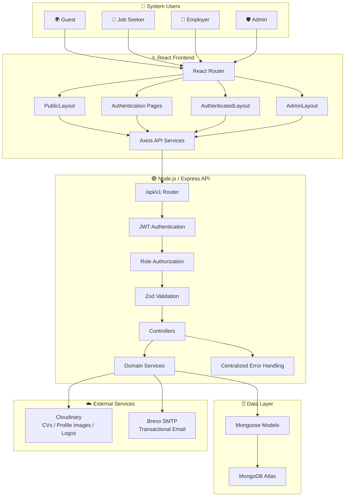
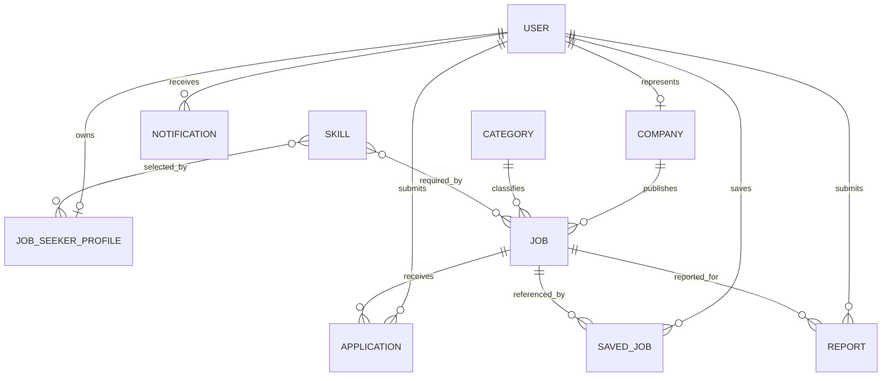
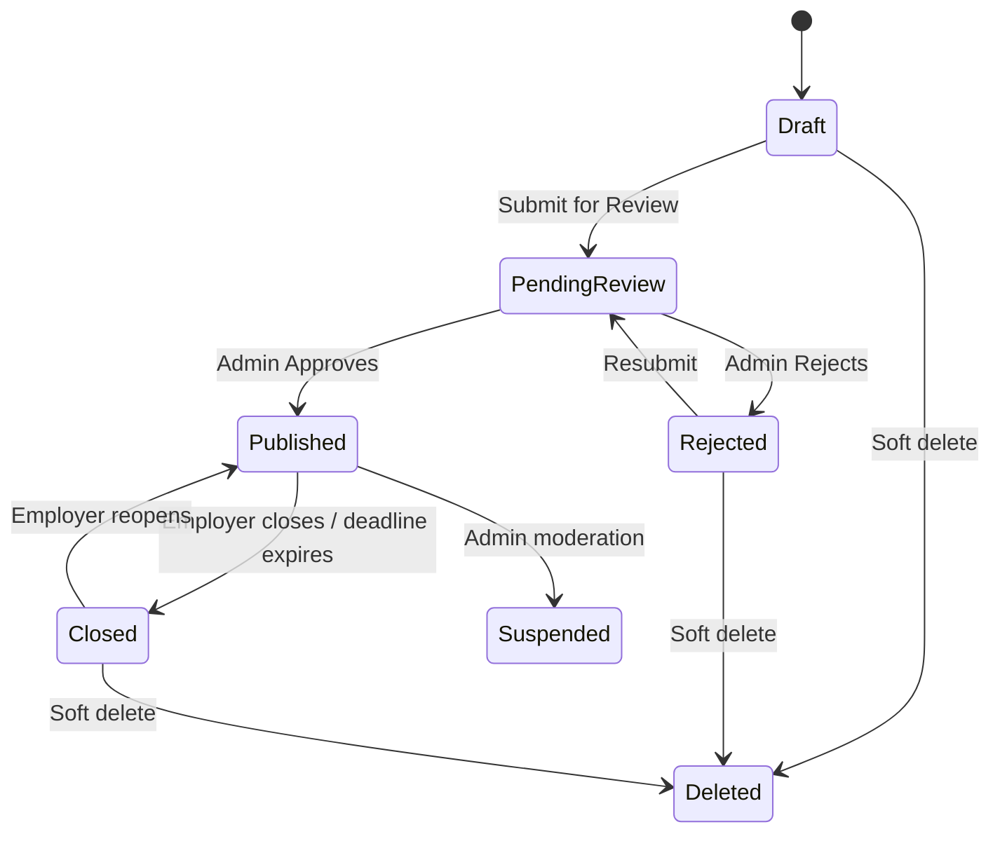
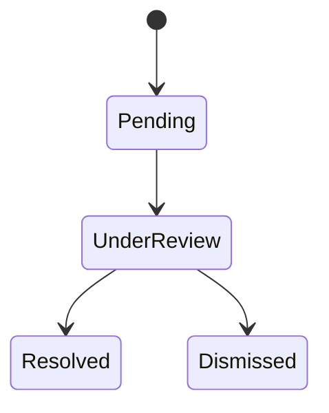
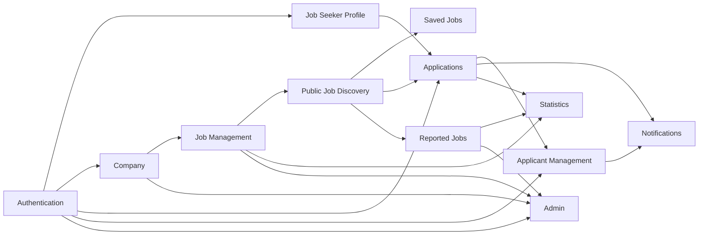
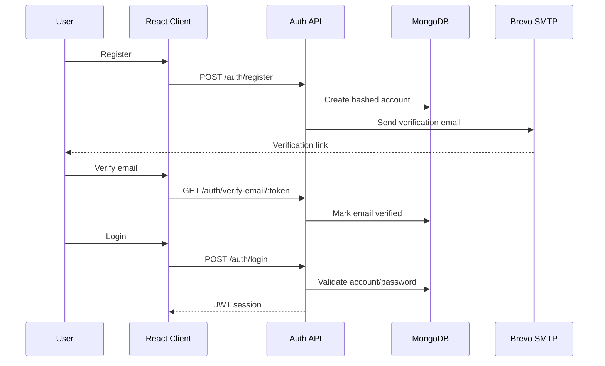
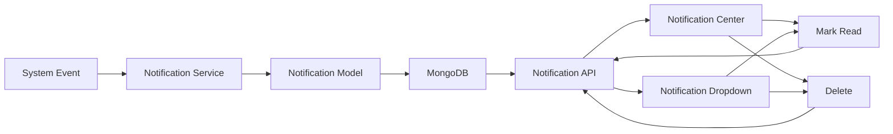

<div align="center">

# 💼 Gamage Recruiters Job Portal System

### Web-Based Recruitment & Application Management Platform

A full-stack recruitment platform developed for **Gamage Recruiters (PVT) Ltd** to connect Job Seekers, Employers and Administrators through a secure, responsive and structured recruitment workflow.


**Gamage Recruiters (PVT) Ltd · Software Engineering Team**

**Team Lead Intern – Software Engineering:** Sithum Buddhika Jayalal


`develop` contains the completed integrated development build and is the handover point for formal QA, regression testing, bug fixing and deployment preparation.

</div>

---

## 📌 Table of Contents

1. [Project Overview](#-project-overview)
2. [Project Status](#-project-status)
3. [Business Problem](#-business-problem)
4. [Project Objectives](#-project-objectives)
5. [User Roles](#-user-roles)
6. [Major System Capabilities](#-major-system-capabilities)
7. [System Architecture](#%EF%B8%8F-system-architecture)
8. [Architecture Principles](#-architecture-principles)
9. [Technology Stack](#-technology-stack)
10. [Repository Structure](#-repository-structure)
11. [Frontend Route Map](#%EF%B8%8F-frontend-route-map)
12. [Backend API Architecture](#-backend-api-architecture)
13. [Core Domain Models](#%EF%B8%8F-core-domain-models)
14. [Domain Ownership](#-domain-ownership)
15. [Shared Status Contracts](#%EF%B8%8F-shared-status-contracts)
16. [Module 1 — Authentication & Public Job Discovery](#-module-1--authentication--public-job-discovery)
17. [Module 2 — Job Seeker Profile Management](#-module-2--job-seeker-profile-management)
18. [Module 3 — Applications, Saved Jobs & Application Timeline](#-module-3--applications-saved-jobs--application-timeline)
19. [Module 4 — Employer & Company Profile](#-module-4--employer--company-profile)
20. [Module 5 — Job Management](#-module-5--job-management)
21. [Module 6 — Applicant Management](#-module-6--applicant-management)
22. [Module 7 — Admin Management & Moderation](#%EF%B8%8F-module-7--admin-management--moderation)
23. [Module 8 — Notifications, Email Events & Statistics](#-module-8--notifications-email-events--statistics)
24. [Module 9 — Help, Support & Reported Jobs](#-module-9--help-support--reported-jobs)
25. [Cross-Module Integration](#-cross-module-integration)
26. [Authentication & Authorization](#-authentication--authorization)
27. [Security Architecture](#%EF%B8%8F-security-architecture)
28. [CV, Image & Media Security](#-cv-image--media-security)
29. [Email System](#%EF%B8%8F-email-system)
30. [Notification System](#-notification-system)
31. [Statistics & Dashboard Integration](#-statistics--dashboard-integration)
32. [Responsive Design](#-responsive-design)
33. [Validation & Error Handling](#-validation--error-handling)
34. [Important Engineering Problems Solved](#-important-engineering-problems-solved)
35. [Testing & Development Verification](#-testing--development-verification)
36. [Local Development Setup](#-local-development-setup)
37. [Frontend Setup](#%EF%B8%8F-frontend-setup)
38. [Backend Setup](#-backend-setup)
39. [Environment Variables](#-environment-variables)
40. [Available NPM Scripts](#-available-npm-scripts)
41. [Git & Pull Request Workflow](#-git--pull-request-workflow)
42. [Code Quality Standards](#-code-quality-standards)
43. [QA Handover](#-qa-handover)
44. [Known Limitations & QA Notes](#%EF%B8%8F-known-limitations--qa-notes)
45. [Out-of-Scope & Future Enhancements](#-out-of-scope--future-enhancements)
46. [Development Team](#development-team)
47. [Pull Request History by Module](#-pull-request-history-by-module)
48. [Security Notice](#-security-notice)
49. [Contribution Guidelines](#-contribution-guidelines)
50. [Deployment Direction](#-deployment-direction)
51. [Licence](#-licence)
52. [Final Handover Statement](#-final-handover-statement)

---

# 🌐 Project Overview

The **Gamage Recruiters Job Portal System** is a full-stack web application designed to digitize and manage the recruitment process between Job Seekers, Employers and platform Administrators.

The platform provides a connected workflow covering:

- user registration and authentication;
- email verification;
- password recovery;
- public job discovery;
- advanced job filtering;
- Job Seeker profile management;
- CV and profile-image management;
- employer/company profile management;
- job creation and lifecycle management;
- saved jobs;
- online applications;
- application-history tracking;
- employer applicant management;
- secure applicant CV access;
- application status management;
- in-app notifications;
- email notifications;
- dashboard statistics;
- employer verification;
- user administration;
- job moderation;
- category and skill management;
- reported-job moderation;
- help and support functionality;
- public informational pages;
- responsive layouts across the system.

Rather than developing isolated frontend demonstrations, the project was implemented as an **integrated MERN application** with real frontend-to-backend communication, persistent MongoDB data, authenticated routes, role-based authorization and shared domain contracts.

---

# 🚦 Project Status

| Area | Current Status |
|---|---|
| Requirement Analysis | ✅ Completed |
| System Design | ✅ Completed |
| Low-Fidelity Wireframes | ✅ Completed |
| UI/UX Design | ✅ Completed |
| Backend Development | ✅ Completed |
| Frontend Development | ✅ Completed |
| Frontend ↔ Backend Integration | ✅ Completed |
| Module-Level Verification | ✅ Completed |
| Responsive Implementation | ✅ Completed |
| Pull Request Review | ✅ Completed |
| Development Integration into `develop` | ✅ Completed |
| Formal QA / System Testing | 🔄 Next Phase |
| Regression & Bug Fixing | 🔄 QA Phase |
| Deployment Preparation | ⏳ After QA |
| Production Release | ⏳ Pending Approval |

> **Development handover status:** The approved MVP development scope has been implemented and integrated into `develop`. The project is now ready for formal QA, system-level regression testing and deployment preparation.

---

# 🎯 Business Problem

Traditional recruitment processes frequently involve disconnected workflows such as:

- vacancy advertisements in multiple places;
- applications received through email;
- manually maintained candidate lists;
- CV files stored without consistent access control;
- no centralized application lifecycle;
- limited communication between employers and candidates;
- difficult tracking of hiring progress;
- inconsistent employer verification;
- manual moderation of job advertisements;
- little visibility into platform activity.

The Job Portal System addresses these problems by creating a single digital recruitment environment in which the major recruitment activities share the same users, jobs, applications, companies, statuses and authorization rules.

---

# 🥅 Project Objectives

The primary objectives of the system are to:

- provide a modern web-based recruitment portal;
- simplify job discovery for candidates;
- allow Job Seekers to maintain reusable professional profiles;
- provide secure CV storage and controlled CV access;
- allow Employers to create and manage company profiles;
- provide a structured job-posting lifecycle;
- allow Employers to manage applicants efficiently;
- provide Job Seekers with transparent application tracking;
- send appropriate in-app and email notifications;
- allow Administrators to moderate users, employers, jobs and reports;
- centralize Categories and Skills;
- prevent duplicate or conflicting shared-domain implementations;
- provide responsive desktop, tablet and mobile experiences;
- enforce authentication and role-based authorization;
- preserve data integrity across module boundaries;
- prepare the platform for structured QA and future deployment.

---

# 👥 User Roles

## 🌍 Guest / Public Visitor

A Guest can:

- view the landing page;
- browse published jobs;
- search for jobs;
- filter jobs;
- view job details;
- view verified public company information;
- access About, Contact, FAQ and Help pages;
- access the Support form;
- navigate to registration and login.

Protected actions such as applying or saving jobs require authentication.

---

## 👤 Job Seeker

A Job Seeker can:

- register an account;
- verify their email;
- log in securely;
- recover/reset their password;
- manage their professional profile;
- manage education;
- manage work experience;
- manage skills;
- manage portfolio links;
- upload and replace a profile image;
- upload, replace and remove a CV;
- obtain protected CV access;
- view profile completion;
- view the Job Seeker dashboard;
- discover jobs;
- save jobs;
- remove saved jobs;
- apply for jobs;
- view application history;
- inspect application details;
- follow the application status timeline;
- report suspicious jobs;
- view their reported jobs;
- receive notifications;
- manage notification read/delete state.

---

## 🏢 Employer

An Employer can:

- register and verify an account;
- create a Company Profile;
- edit Company information;
- manage Company branding/logo;
- view verification status;
- access the Employer Dashboard;
- create Job posts;
- save Job drafts;
- submit Jobs for review;
- edit eligible Job posts;
- preview Jobs;
- close Jobs;
- reopen Jobs;
- soft-delete eligible Jobs;
- inspect Job status/history;
- view applicant counts;
- search/filter applicant records;
- view Applicant Details;
- view/download authorized Applicant CV snapshots;
- shortlist candidates;
- reject candidates;
- update application statuses;
- optionally add status-change notes;
- receive application notifications;
- view Employer statistics.

---

## 🛡️ Administrator

An Administrator can:

- access the protected Admin Console;
- view administrative dashboard statistics;
- manage Job Seeker and Employer accounts;
- search/filter users;
- suspend/reactivate accounts;
- inspect Employer profiles;
- approve/reject Employer verification;
- inspect and moderate Job posts;
- manage Categories;
- manage Skills;
- inspect reported jobs;
- review, resolve or dismiss reports;
- add review notes;
- use pending-item deep links from the Admin Dashboard.

---

# ✨ Major System Capabilities

## 🔐 Identity & Access

- JWT-based authentication
- bcrypt password hashing
- email verification
- resend verification flow
- forgot-password flow
- reset-password flow
- session persistence
- token-version based session invalidation after password reset
- frontend role guards
- backend authorization middleware
- account-status enforcement

## 🔍 Recruitment Discovery

- public landing page
- published-job listing
- keyword search
- location search
- structured filters
- salary range matching
- experience filtering
- Job Type filtering
- Work Mode filtering
- posted-date filtering
- pagination
- similar-job recommendations
- public Company information
- view tracking

## 👤 Professional Profiles

- profile information
- skills
- education
- experience
- portfolio links
- CV
- profile image
- dynamic completion calculation
- dashboard statistics

## 🏢 Employer Operations

- Company Profile lifecycle
- verification state
- Company logo management
- Job lifecycle management
- applicant management
- CV review
- recruitment statistics

## 📝 Application Management

- secure Apply Job workflow
- duplicate protection
- application-time CV snapshot
- Saved Jobs
- Application History
- Application Details
- chronological status timeline
- employer status changes

## 🔔 Communication

- in-app notifications
- unread count
- filters
- mark read
- mark all read
- delete
- delete all
- notification dropdown
- verification email
- password reset email
- application-submitted email
- new-application email
- application-status-change email

## 🛡️ Platform Moderation

- user management
- employer verification
- Job moderation
- Categories
- Skills
- reported-job review
- dashboard statistics

---

# 🏗️ System Architecture



---

# 🧭 Architecture Principles

The application follows several project-wide architectural rules.

## 1. Single Monorepository

The frontend, backend, project documentation and repository governance are maintained together.

```text
job-portal-system/
├── client/
├── server/
├── docs/
└── .github/
```

---

## 2. Shared Domain Ownership

Each important database domain has one primary owner.

Other modules **reuse** the approved model/API rather than recreating it.

This prevents:

- duplicate models;
- conflicting fields;
- inconsistent status values;
- duplicated APIs;
- destructive cross-module changes.

---

## 3. Layered Backend

Backend responsibilities are separated into:

```text
Route
   ↓
Authentication / Authorization
   ↓
Validation
   ↓
Controller
   ↓
Service
   ↓
Mongoose Model
   ↓
MongoDB
```

The intention is to keep HTTP concerns, business logic and persistence responsibilities separated.

---

## 4. Shared API Contract

All backend APIs use the common versioned prefix:

```text
/api/v1
```

Modules are mounted beneath that shared API gateway.

---

## 5. Role-Based Frontend Layouts

The UI is separated into:

- `PublicLayout`
- authentication-specific pages
- `AuthenticatedLayout`
- `AdminLayout`

Different roles therefore receive the appropriate navigation and portal context without duplicating the whole application shell.

---

## 6. Backend as Security Authority

Sensitive business rules must not depend only on disabled frontend buttons.

Examples include:

- authenticated-user ownership;
- CV access;
- Job ownership;
- account status;
- application ownership;
- notification ownership;
- Admin moderation;
- report ownership.

---

# 🧰 Technology Stack

## Frontend

| Technology | Purpose |
|---|---|
| React | Component-based frontend |
| React DOM | Browser rendering |
| Vite | Development server and production bundling |
| JavaScript | Application language |
| Tailwind CSS | Utility-first responsive styling |
| React Router | Client-side routing |
| Axios | HTTP/API communication |
| React Hook Form | Form state management |
| Zod | Schema-based frontend validation |
| `@hookform/resolvers` | React Hook Form + Zod integration |
| React Hot Toast | User feedback notifications |
| Lucide React | Consistent interface iconography |
| ESLint | Static code quality |
| Prettier | Code formatting |

### Current Client Package Direction

```text
React                    19.x
React Router DOM         7.x
Axios                    1.x
React Hook Form          7.x
Zod                      4.x
Tailwind CSS             4.x
Vite                     8.x
```

---

## Backend

| Technology | Purpose |
|---|---|
| Node.js | Backend runtime |
| Express.js | REST API server |
| JavaScript / ES Modules | Backend implementation |
| Mongoose | MongoDB object modelling |
| MongoDB Atlas | Persistent cloud database |
| JSON Web Token | Authentication |
| bcrypt | Password hashing |
| Zod | Request validation |
| Multer | Multipart upload handling |
| Cloudinary SDK | Managed media/file storage |
| Nodemailer | Transactional email transport |
| Brevo SMTP | Email provider |
| Helmet | HTTP security headers |
| CORS | Cross-origin controls |
| Express Rate Limit | Abuse/rate limiting |
| Morgan | HTTP request logging |
| dotenv | Environment configuration |
| ESLint | Static code analysis |
| Prettier | Formatting |
| Nodemon | Development server reload |

---

# 📁 Repository Structure

```text
job-portal-system/
│
├── .github/
│   ├── CODEOWNERS
│   ├── pull_request_template.md
│   └── issue templates / workflow files
│
├── client/
│   ├── public/
│   │
│   ├── src/
│   │   ├── assets/
│   │   │   └── approved static images and assets
│   │   │
│   │   ├── components/
│   │   │   └── reusable shared components
│   │   │
│   │   ├── context/
│   │   │   └── shared React context such as authentication
│   │   │
│   │   ├── features/
│   │   │   ├── authentication/
│   │   │   ├── public-jobs/
│   │   │   ├── job-seeker-profile/
│   │   │   ├── saved-jobs/
│   │   │   ├── applications/
│   │   │   ├── employer-profile/
│   │   │   ├── job-management/
│   │   │   ├── applicant-management/
│   │   │   ├── notifications/
│   │   │   ├── reported-jobs/
│   │   │   ├── help-support/
│   │   │   └── admin/
│   │   │
│   │   ├── hooks/
│   │   │   └── shared React hooks
│   │   │
│   │   ├── layouts/
│   │   │   ├── public/
│   │   │   ├── authenticated/
│   │   │   └── admin/
│   │   │
│   │   ├── pages/
│   │   │   └── shared route-level pages
│   │   │
│   │   ├── routes/
│   │   │   ├── AppRoutes.jsx
│   │   │   └── ProtectedRoute.jsx
│   │   │
│   │   ├── services/
│   │   │   └── shared Axios/API services
│   │   │
│   │   ├── constants/
│   │   │   └── statuses, roles and options
│   │   │
│   │   ├── validations/
│   │   │   └── frontend schemas
│   │   │
│   │   └── utils/
│   │       └── shared frontend utilities
│   │
│   ├── .env.example
│   ├── package.json
│   └── vite.config.js
│
├── server/
│   ├── src/
│   │   ├── config/
│   │   │   ├── environment configuration
│   │   │   ├── database configuration
│   │   │   └── Cloudinary configuration
│   │   │
│   │   ├── constants/
│   │   │   ├── roles
│   │   │   ├── statuses
│   │   │   └── notification types
│   │   │
│   │   ├── controllers/
│   │   │   └── HTTP request/response handling
│   │   │
│   │   ├── jobs/
│   │   │   └── background Job lifecycle processing
│   │   │
│   │   ├── middleware/
│   │   │   ├── authentication
│   │   │   ├── authorization
│   │   │   ├── validation
│   │   │   ├── uploads
│   │   │   ├── rate limiting
│   │   │   └── error handling
│   │   │
│   │   ├── models/
│   │   │   └── shared Mongoose domain models
│   │   │
│   │   ├── routes/
│   │   │   └── versioned REST API route modules
│   │   │
│   │   ├── services/
│   │   │   └── domain/business logic
│   │   │
│   │   ├── utils/
│   │   │   └── reusable backend helpers
│   │   │
│   │   ├── validations/
│   │   │   └── Zod request schemas
│   │   │
│   │   └── server.js
│   │
│   ├── .env.example
│   └── package.json
│
├── docs/
│   ├── architecture/
│   ├── api/
│   ├── database/
│   ├── ownership/
│   └── setup/
│
├── .editorconfig
├── .gitattributes
├── .gitignore
├── .prettierignore
├── .prettierrc.json
├── CONTRIBUTING.md
├── SECURITY.md
├── gamage_recruiters_auth.postman_collection.json
└── README.md
```

---

# 🗺️ Frontend Route Map

The application uses centralized routing through `AppRoutes.jsx`.

## 🌍 Public & Authentication Routes

| Route | Purpose |
|---|---|
| `/` | Public landing page |
| `/jobs` | Public Job discovery |
| `/jobs/:id` | Public Job details |
| `/about` | About page |
| `/contact` | Contact page |
| `/faq` | FAQ page |
| `/help` | Help page |
| `/support` | Support form |
| `/login` | Login |
| `/register` | Registration |
| `/verify-email` | Email verification |
| `/forgot-password` | Forgot password |
| `/reset-password` | Reset password |
| `/unauthorized` | Permission-denied page |

---

## 👤 Job Seeker Routes

| Route | Purpose |
|---|---|
| `/dashboard` | Job Seeker Dashboard |
| `/profile` | My Profile |
| `/profile/edit` | Edit Profile |
| `/profile/completion` | Profile Completion |
| `/profile/skills` | Skills Management |
| `/profile/education` | Education Management |
| `/profile/experience` | Experience Management |
| `/profile/portfolio` | Portfolio Links |
| `/profile/cv` | CV Management |
| `/saved-jobs` | Saved Jobs |
| `/my-applications` | Application History |
| `/my-applications/:id` | Application Details |
| `/my-reported-jobs` | Job Seeker's Reports |
| `/report-details/:id` | Report Details |
| `/notifications` | Notification Center |

---

## 🏢 Employer Routes

| Route | Purpose |
|---|---|
| `/employer/dashboard` | Employer Dashboard |
| `/employer/company` | Company Profile |
| `/company/profile` | Company Profile alias |
| `/employer/company/create` | Create Company |
| `/employer/company/edit` | Edit Company |
| `/jobs/create` | Create Job |
| `/jobs/manage` | Manage Jobs |
| `/jobs/:jobId/edit` | Edit Job |
| `/jobs/:jobId/preview` | Employer Job Preview |
| `/applicants` | Applicant List |
| `/applicants/:id` | Applicant Details |
| `/applicants/:id/cv` | Applicant CV Viewer |
| `/notifications` | Notification Center |

---

## 🛡️ Admin Routes

The Admin Console uses nested routing beneath `/admin`.

| Route | Purpose |
|---|---|
| `/admin` | Admin Dashboard |
| `/admin/users` | User Management |
| `/admin/users/:userId` | User Details |
| `/admin/employers` | Employer Management |
| `/admin/employers/:companyId` | Employer Details |
| `/admin/jobs` | Job Moderation |
| `/admin/jobs/:id` | Job Moderation Details |
| `/admin/categories` | Categories & Skills Management |
| `/admin/reported-jobs` | Reported Jobs |
| `/admin/reported-jobs/:id` | Report Review Details |

Unknown nested Admin routes fall back to the Admin placeholder instead of breaking the main console.

---

# 🔌 Backend API Architecture

All APIs are mounted below:

```text
/api/v1
```

## Top-Level API Families

```text
/api/v1/health
/api/v1/auth
/api/v1/reports
/api/v1/support
/api/v1/categories
/api/v1/skills
/api/v1/notifications
/api/v1/jobs
/api/v1/employer/jobs
/api/v1/job-seeker-profile
/api/v1/companies
/api/v1/statistics
/api/v1/applications
/api/v1/admin/employers
/api/v1/applicants
/api/v1/admin/users
/api/v1/admin/jobs
/api/v1/admin/reports
/api/v1/saved-jobs
```

---

## 🔐 Authentication APIs

| Method | Endpoint | Access | Purpose |
|---|---|---|---|
| POST | `/api/v1/auth/register` | Public | Register Job Seeker / Employer |
| POST | `/api/v1/auth/login` | Public | Authenticate and issue session token |
| GET | `/api/v1/auth/verify-email/:token` | Public | Verify email address |
| POST | `/api/v1/auth/resend-verification` | Public | Request new verification email |
| POST | `/api/v1/auth/forgot-password` | Public | Start password reset |
| POST | `/api/v1/auth/reset-password` | Public | Reset password |
| GET | `/api/v1/auth/me` | Authenticated | Retrieve current account |

Password recovery routes use rate limiting.

---

## 🔍 Public Job APIs

| Method | Endpoint | Access | Purpose |
|---|---|---|---|
| GET | `/api/v1/jobs` | Public | Paginated published Jobs |
| GET | `/api/v1/jobs/search` | Public | Keyword/location search |
| GET | `/api/v1/jobs/filter` | Public | Structured Job filtering |
| GET | `/api/v1/jobs/:id` | Public | Job details and similar Jobs |

Only published, non-deleted Jobs are exposed through public discovery.

---

## 🏢 Employer Job APIs

| Method | Endpoint | Access | Purpose |
|---|---|---|---|
| POST | `/api/v1/employer/jobs` | Employer | Create Job draft |
| GET | `/api/v1/employer/jobs` | Employer | List employer-owned Jobs |
| GET | `/api/v1/employer/jobs/:jobId` | Employer | Retrieve owned Job |
| PATCH | `/api/v1/employer/jobs/:jobId` | Employer | Edit eligible Job |
| DELETE | `/api/v1/employer/jobs/:jobId` | Employer | Soft-delete eligible Job |
| PATCH | `/api/v1/employer/jobs/:jobId/submit-for-review` | Employer | Submit Job for Admin review |
| PATCH | `/api/v1/employer/jobs/:jobId/close` | Employer | Close published Job |
| PATCH | `/api/v1/employer/jobs/:jobId/reopen` | Employer | Reopen closed Job |

Employer ownership is derived from the authenticated account rather than trusted from user-supplied identifiers.

---

## 👤 Job Seeker Profile APIs

All routes require an authenticated Job Seeker.

### Profile

```text
GET   /api/v1/job-seeker-profile/me
PATCH /api/v1/job-seeker-profile/me
GET   /api/v1/job-seeker-profile/me/completion
```

### Profile Image

```text
PUT    /api/v1/job-seeker-profile/me/profile-image
DELETE /api/v1/job-seeker-profile/me/profile-image
```

### CV

```text
PUT    /api/v1/job-seeker-profile/me/cv
GET    /api/v1/job-seeker-profile/me/cv/download-url
DELETE /api/v1/job-seeker-profile/me/cv
```

### Education

```text
POST   /api/v1/job-seeker-profile/me/education
PATCH  /api/v1/job-seeker-profile/me/education/:entryId
DELETE /api/v1/job-seeker-profile/me/education/:entryId
```

### Experience

```text
POST   /api/v1/job-seeker-profile/me/experience
PATCH  /api/v1/job-seeker-profile/me/experience/:entryId
DELETE /api/v1/job-seeker-profile/me/experience/:entryId
```

### Portfolio

```text
POST   /api/v1/job-seeker-profile/me/portfolio
PATCH  /api/v1/job-seeker-profile/me/portfolio/:entryId
DELETE /api/v1/job-seeker-profile/me/portfolio/:entryId
```

### Skills

```text
PATCH /api/v1/job-seeker-profile/me/skills
```

---

## 🏢 Company APIs

| Method | Endpoint | Access | Purpose |
|---|---|---|---|
| POST | `/api/v1/companies` | Employer | Create Company Profile |
| GET | `/api/v1/companies/me` | Employer | Retrieve own Company |
| PUT | `/api/v1/companies/me` | Employer | Update Company |
| POST | `/api/v1/companies/me/logo` | Employer | Upload/replace Company logo |
| PUT | `/api/v1/companies/me/logo` | Employer | Upload/replace Company logo |
| DELETE | `/api/v1/companies/me` | Employer | Delete Company when allowed |
| GET | `/api/v1/companies/:id` | Public | Restricted public Company view |

Company deletion is guarded when Jobs still reference the Company.

---

## 📝 Application APIs

All application routes require a Job Seeker.

```text
POST /api/v1/applications
GET  /api/v1/applications
GET  /api/v1/applications/:id
```

These provide:

- Job application submission;
- Application History;
- individual Application Details.

The current approved MVP intentionally does not expose a Job Seeker Withdraw Application endpoint.

---

## 🔖 Saved Job APIs

```text
POST   /api/v1/saved-jobs
GET    /api/v1/saved-jobs
DELETE /api/v1/saved-jobs/:jobId
```

Saved Job responses use controlled Job data and handle unavailable/soft-deleted Job records safely.

---

## 👥 Applicant Management APIs

| Method | Endpoint | Purpose |
|---|---|---|
| GET | `/api/v1/applicants` | List/search/filter applicants |
| GET | `/api/v1/applicants/:id` | Applicant Details |
| GET | `/api/v1/applicants/:id/cv` | Controlled CV access |
| PATCH | `/api/v1/applicants/:id/status` | Generic status update |
| PATCH | `/api/v1/applicants/:id/shortlist` | Shortlist applicant |
| PATCH | `/api/v1/applicants/:id/reject` | Reject applicant |

The backend performs ownership and authorization checks before sensitive applicant information is returned.

---

## 🔔 Notification APIs

```text
GET    /api/v1/notifications
GET    /api/v1/notifications/unread-count
PATCH  /api/v1/notifications/mark-all-read
PATCH  /api/v1/notifications/:id/read
DELETE /api/v1/notifications/delete-all
DELETE /api/v1/notifications/:id
```

---

## 📊 Statistics APIs

```text
GET /api/v1/statistics/job-seeker
GET /api/v1/statistics/employer
GET /api/v1/statistics/admin
```

Each endpoint is role protected.

---

## 🚩 Job Report APIs

```text
POST /api/v1/reports
GET  /api/v1/reports/my-reports
GET  /api/v1/reports/:id
```

Job Seekers can submit and inspect their own reports.

---

## 💬 Support API

```text
POST /api/v1/support
```

Support submission is protected by validation and rate limiting.

---

## 🗂️ Category APIs

```text
GET   /api/v1/categories
GET   /api/v1/categories/all
POST  /api/v1/categories
PATCH /api/v1/categories/:id
```

Administrative write operations are role protected.

---

## 🧠 Skill APIs

```text
GET   /api/v1/skills
GET   /api/v1/skills/all
POST  /api/v1/skills
PATCH /api/v1/skills/:id
```

---

## 🛡️ Admin Employer APIs

```text
GET   /api/v1/admin/employers
GET   /api/v1/admin/employers/:companyId
PATCH /api/v1/admin/employers/:companyId/verification
```

---

## 🛡️ Admin User APIs

```text
GET   /api/v1/admin/users
GET   /api/v1/admin/users/stats
POST  /api/v1/admin/users
GET   /api/v1/admin/users/:userId
PATCH /api/v1/admin/users/:userId
PATCH /api/v1/admin/users/:userId/status
```

---

## 🛡️ Admin Job Moderation APIs

```text
GET   /api/v1/admin/jobs
GET   /api/v1/admin/jobs/:jobId
PATCH /api/v1/admin/jobs/:jobId/moderation
```

---

## 🛡️ Admin Report APIs

```text
GET   /api/v1/admin/reports
GET   /api/v1/admin/reports/:reportId
PATCH /api/v1/admin/reports/:reportId/review
```

---

# 🗄️ Core Domain Models

The integrated platform revolves around the following major data domains:

```text
User
JobSeekerProfile
Company
Job
Application
SavedJob
Notification
Category
Skill
Report
SupportMessage
```

A simplified domain relationship can be represented as:



---

# 👑 Domain Ownership

Shared-domain ownership was intentionally controlled to avoid duplicated Mongoose models and incompatible contracts.

| Domain | Primary Owner | Major Consumers |
|---|---|---|
| User / Authentication | Bimsara Rathnayake | Profile, Employer, Applications, Applicants, Admin, Notifications |
| JobSeekerProfile | Hiba | Applications, Applicants, Admin |
| Company | Injas Ifham | Jobs, Applicants, Admin, Reports |
| Job | M. P. P. Disura Sandaruwan | Public Jobs, Applications, Applicants, Admin, Notifications, Reports |
| Application | S. S. Madushika Chathuranganee | Applicant Management, Admin, Statistics, Notifications |
| SavedJob | S. S. Madushika Chathuranganee | Job Seeker UI |
| Notification | Danaja Pathmakumara | All event-producing modules |
| Category | M.A. Sahan Viduranga | Public Jobs, Job Management |
| Skill | M.A. Sahan Viduranga | Job Seeker Profile, Job Management |
| Report | H.M. Dulanjanee Anuruddhika | Admin Moderation |
| SupportMessage | H.M. Dulanjanee Anuruddhika | Help / Support |

### Shared-Model Rule

When another module needs a structural change to a shared domain:

1. discuss the requirement with the primary owner;
2. explain the reason and affected integrations;
3. confirm the final API/data contract;
4. update the shared implementation once;
5. preserve all existing consumers;
6. submit the change through a Pull Request;
7. verify the latest `develop` before merge.

---

# 🏷️ Shared Status Contracts

Status values are shared contracts, not arbitrary display strings.

## Account

```text
active
suspended
inactive
```

## Employer Verification

```text
pending
verified
rejected
```

## Job Lifecycle

```text
draft
pending_review
published
closed
suspended
rejected
```

## Application Lifecycle

```text
applied
under_review
shortlisted
selected
rejected
withdrawn
```

> The data model recognizes `withdrawn`; however, the Job Seeker self-withdraw workflow is outside the currently approved implemented MVP.

## Report Lifecycle

```text
pending
under_review
resolved
dismissed
```

## Notification

Read/unread behaviour is represented through notification state rather than inventing separate incompatible spellings in different modules.

---

# 🔐 Module 1 — Authentication & Public Job Discovery

**Primary Developer:** Bimsara Rathnayake  
**Final Status:** ✅ Completed

## Delivered Functionality

### Authentication

- registration;
- role selection;
- password hashing;
- JWT session creation;
- email verification;
- resend verification;
- login;
- unverified-account protection;
- forgot password;
- password reset;
- authenticated-user retrieval;
- session persistence;
- protected frontend routes;
- role-aware redirection.

### Public Discovery

- modern landing page;
- Featured Jobs;
- animated platform statistics;
- category quick filters;
- How It Works content;
- CTA sections;
- public Job listing;
- Job Details;
- keyword search;
- location search;
- structured filters;
- pagination;
- similar Jobs;
- role-aware Save Job action;
- role-aware Report Job action.

### Shared Layout Work

- `PublicLayout`;
- `PublicFooter`;
- role-aware public navigation behaviour;
- `AdaptiveJobsLayout`;
- Admin route integration support;
- frontend role routing.

---

## Important Technical Decisions

### Password Security

Passwords are hashed before storage using bcrypt.

### Public Job Projection

Public discovery intentionally exposes a controlled set of Job fields instead of unrestricted model documents.

### Search Input Escaping

User-entered search values are escaped before being used in regular expressions.

### Similar Jobs

Job Details returns a small recommendation set based on compatible Job properties such as Category and Job Type.

### Adaptive Layout

`/jobs` and `/jobs/:id` can present different layout behaviour depending on the authenticated role without duplicating the actual discovery pages.

---

## Engineering Problems Solved

### 1. Verify Email page could enter an incorrect loading/404 state

**Cause:** the frontend lifecycle and route-token handling could race during initial rendering.

**Resolution:** route/loading state handling was corrected so verification waits for the expected route information.

---

### 2. Brevo SMTP rejected development traffic

**Symptom:** SMTP authorization/IP error during email testing.

**Resolution:** the development SMTP environment and authorized sender/IP configuration were corrected without hard-coding credentials into source control.

---

### 3. Verification-token testing was unnecessarily manual

**Problem:** repeatedly copying development verification tokens slowed API verification.

**Resolution:** development-only test support was used so test automation could capture the token without changing production security behaviour.

---

### 4. PublicLayout crossed another component's ownership boundary

**Problem:** the first implementation also included a top navigation area that belonged to separate shared navigation ownership.

**Resolution:** the layout was reduced to its approved responsibility and preserved the shared footer without duplicating unrelated components.

---

### 5. Frontend filters did not match backend API semantics

**Problem:** Job Type and Work Mode UI originally supported multiple selected values while the backend expected one value.

**Resolution:** the controls were changed to single-select behaviour so UI state exactly matches the backend contract.

---

### 6. URL query state and filter-control state became inconsistent

**Problem:** clearing URL query values could leave the visual filter controls selected.

**Resolution:** filter state was synchronized from URL state and reset logic was corrected.

---

### 7. Landing page consumed the wrong `listJobs()` response level

**Problem:** the service already returned the relevant API data object, while the page attempted to unwrap an additional `.data`.

**Resolution:** the landing page was aligned with the real service contract.

---

### 8. Category label schema mismatch

**Problem:** UI initially expected `name`; the shared Category schema used `categoryName`.

**Resolution:** the component was updated to the approved reference-data field.

---

### 9. Admin was accidentally given the Job Seeker authenticated layout on public Job pages

**Resolution:** layout selection was explicitly restricted to the correct Job Seeker and Employer roles.

---

### 10. Signed-in Job Seekers saw Guest-oriented footer links

**Resolution:** the footer became role-aware and provides portal destinations for authenticated users.

---

## Pull Requests

- PR #3 — Authentication Backend
- PR #9 — Authentication Frontend
- PR #13 — Password Reset Backend
- PR #14 — Password Reset Frontend
- PR #15 — Public Jobs API
- PR #28 — Public Footer & Layout
- PR #37 — Public Jobs Frontend
- PR #51 — Job Detail Save/Report Actions
- PR #73 — Admin Routing Integration
- PR #101 — Public Home Page & Adaptive Job Layout

---

# 👤 Module 2 — Job Seeker Profile Management

**Primary Developer:** Hiba  
**Final Status:** ✅ Development Completed — 100%

## Delivered Functionality

- Job Seeker Profile backend;
- My Profile page;
- Edit Profile;
- Skills Management;
- Education Management;
- Experience Management;
- Portfolio Link Management;
- Profile Completion;
- CV Management;
- Profile Image Management;
- Job Seeker Dashboard;
- secure Cloudinary-based file handling;
- responsive profile interfaces.

---

## Dynamic Profile Completion

Profile completion is calculated using real stored profile sections rather than a hard-coded percentage.

The implementation considers areas such as:

- basic profile information;
- skills;
- education;
- experience;
- CV;
- profile image;
- portfolio information.

This allows the dashboard and Profile Completion screen to communicate meaningful profile readiness.

---

## Secure CV Design

The profile module avoids treating a CV as an ordinary public static file.

The secure workflow is conceptually:

```text
Authenticated Job Seeker
        ↓
Authorization
        ↓
CV ownership check
        ↓
Generate short-lived protected URL
        ↓
Return temporary access
```

This reduces the risk of exposing permanent CV URLs through ordinary API responses.

---

## File Validation

CV and profile-image flows include constraints such as:

- supported file types;
- file-size restrictions;
- authenticated ownership;
- controlled replacement;
- controlled deletion;
- Cloudinary-backed storage.

---

## Skills Integration

The profile does not create its own Skill vocabulary.

It consumes the shared Skills domain managed by the Admin module.

Special technical terms such as:

```text
C++
C#
.NET
Node.js
UI/UX
```

were considered during validation/search behaviour instead of assuming skill names contain only simple alphabetic characters.

---

## Engineering Problems Solved

### 1. Local setup commands were executed from the wrong directory

The development workflow was corrected by running server-specific commands from the `server` project directory.

---

### 2. Local MongoDB configuration pointed at an incorrect database

The development connection was corrected without committing sensitive connection details.

---

### 3. Temporary MongoDB SRV resolution failures were initially confused with application bugs

The issue was isolated as an environment/network DNS problem instead of changing valid application code.

---

### 4. Education/Experience update tests failed with invalid entry IDs

Generated embedded-record IDs were used correctly during API verification.

---

### 5. Shared route-index conflicts could remove other members' accepted routes

Latest `develop` became the baseline, with only the profile-specific route registration applied on top.

---

### 6. Initial CV design did not provide the required private-access model

The implementation moved to authenticated/protected Cloudinary delivery and short-lived signed access.

---

### 7. Skills collection initially had no usable shared test values

Integration was coordinated with the Skill owner rather than creating a duplicate Skills implementation.

---

### 8. AppRoutes conflicts occurred with Employer Profile work

Both accepted route groups were preserved instead of resolving the conflict by deleting another member's routes.

---

### 9. Education deletion errors were hidden behind modal behaviour

Operation-specific delete feedback was moved into the relevant interaction so the user receives meaningful failure information.

---

### 10. Newly merged routes could be lost during later branch synchronization

`develop` was treated as the source of truth before profile-specific routes were reapplied.

---

### 11. Partial embedded-entry updates required careful validation

Updates were validated against the complete stored record rather than allowing partial data to bypass cross-field rules.

---

## Pull Requests

- PR #11 — Job Seeker Profile Backend Foundation
- PR #22 — Profile APIs & Secure CV Handling
- PR #35 — Portfolio, Skills & Profile Completion
- PR #43 — Profile Frontend & Skills Management
- PR #54 — Education Management
- PR #61 — Experience Management
- PR #64 — Portfolio Links Management
- PR #70 — CV Management
- PR #77 — Profile Image Management
- PR #82 — Job Seeker Dashboard

---

# 📝 Module 3 — Applications, Saved Jobs & Application Timeline

**Primary Developer:** S. S. Madushika Chathuranganee  
**Final Status:** ✅ Completed

## Delivered Backend

- `Application` model;
- `SavedJob` model;
- Apply Job API;
- Saved Job API;
- duplicate/eligibility checks;
- secure CV snapshot handling;
- Application History retrieval;
- Application Details retrieval;
- notification integration.

---

## Delivered Frontend

### Saved Jobs

- card view;
- list view;
- Job search;
- remove Saved Job;
- availability states;
- loading states;
- error states;
- empty states;
- responsive layout.

### Application History

- Application list;
- keyword search;
- status filtering;
- empty-filter state;
- application navigation;
- responsive controls.

### Application Details

- Job information;
- application status;
- status-specific banner;
- cover letter;
- CV information;
- chronological status timeline;
- navigation back to Application History.

### Apply Job

- Job Seeker-only action;
- authentication-aware behaviour;
- frontend modal;
- backend eligibility validation;
- server-derived applicant/CV data.

---

## Application-Time CV Snapshot

A major design decision is that Employer Applicant Management should reference the **CV used at application time**, not blindly expose whatever CV currently exists on the Job Seeker's profile.

Conceptually:

```text
Job Seeker applies
       ↓
Backend validates profile/CV
       ↓
Application stores safe CV snapshot reference
       ↓
Employer later reviews Application
       ↓
Authorized CV endpoint generates temporary access
```

This protects historical application integrity.

---

## Application Status History

The timeline does **not** assume that statuses can only move forward through a fixed visual pipeline.

The actual stored `statusHistory` sequence is rendered chronologically.

For example, unusual but valid administrative histories can remain visible:

```text
Applied
   ↓
Selected
   ↓
Rejected
```

instead of being incorrectly collapsed into a hard-coded progression.

---

## Engineering Problems Solved

### 1. Shared route integration risk

Application work touched shared routing alongside Applicant, Profile, Employer, Notification and Public Job work.

**Resolution:** accepted `develop` routes were preserved rather than replacing the route file with a feature-branch version.

---

### 2. Applicant controller was accidentally overwritten during conflict resolution

**Resolution:** Kalana's accepted Applicant controller was restored directly from `develop`.

---

### 3. Apply Job frontend files leaked into the Saved Jobs branch

**Resolution:** cross-branch files were separated so feature branches remained focused and reviewable.

---

### 4. Apply Job modal disappeared after an unrelated develop merge

Save/Report Job integration unintentionally dropped the Apply integration.

**Resolution:** the Apply flow was restored while preserving the other newly accepted Job Detail functionality.

---

### 5. Apply action required role-aware behaviour

**Resolution:** the public Job Detail action was adjusted so protected application behaviour respects the current account role.

---

### 6. Application Details status messaging was inaccurate

A generic fallback could overstate the meaning of a status.

For example, `selected` must not automatically claim that a formal employment offer has been issued.

**Resolution:** status-specific, factual messages replaced broad assumptions.

---

### 7. Fixed-stage status timeline misrepresented actual history

**Resolution:** the UI now renders the actual chronological backend `statusHistory`.

---

### 8. Duplicate Application History fetch behaviour

Review identified unnecessary/repeated data loading.

**Resolution:** the page's data flow was simplified around the intended source of truth.

---

### 9. Filtered empty state was not sufficiently distinct

**Resolution:** the UI differentiates between:

- no Applications at all;
- no Applications matching the current filters.

---

### 10. Responsive QA hardening

Final responsive work addressed:

- mobile-safe Saved Jobs search;
- 1-column phone layout;
- 2-column tablet layout;
- 3-column larger-screen layout;
- Application History search/filter sizing;
- full-width mobile status controls;
- horizontally usable tabular content where required;
- stacked Application Details heading/status section on narrow screens.

The final responsive hardening was completed through PR #103.

---

## Pull Requests

### Core Module

- PR #1 — Application Model
- PR #25 — SavedJob Model
- PR #33 — Apply Job API
- PR #42 — Saved Job API
- PR #49 — Saved Jobs Frontend
- PR #57 — Application History & Application Details

### Final Responsive Hardening

- PR #103 — Responsive fixes for Saved Jobs, Application History and Application Details

---

## Intentional Scope Boundary

The Job Seeker **Withdraw Application** action is not included in the approved implemented MVP.

The shared Application model recognizes `withdrawn` because Employer-side and historical status handling must remain safe, but a self-service withdrawal API was intentionally not added without a finalized approved flow.

---

# 🏢 Module 4 — Employer & Company Profile

**Primary Developer:** Injas Ifham  
**Final Status:** ✅ Completed / Integrated

## Delivered Functionality

- Company model;
- Company creation;
- own-Company retrieval;
- Company editing;
- Company logo upload;
- Company logo replacement/management;
- Company deletion guard;
- public verified Company view;
- Company verification state;
- Employer Dashboard;
- live Employer statistics;
- recent applicants;
- Job information;
- profile-completeness display;
- skeleton/loading states;
- reusable Employer layout;
- shared non-Admin Sidebar;
- responsive Company forms and pages;
- UI polish, transitions and interaction states.

---

## Company Verification Behaviour

Company verification uses:

```text
pending
verified
rejected
```

Important Company identity changes can invalidate an existing verification and return the Company to `pending`.

This prevents a previously verified Employer from silently replacing critical Company identity details while retaining the original verification decision.

---

## Company Delete Guard

A Company cannot be removed when Jobs still reference it.

This includes retained Job history.

The reason is data integrity:

```text
Company
   │
   └──── Job
           │
           └──── Application / Applicant / Report history
```

Deleting the Company without an approved cascade/snapshot strategy would create broken historical references.

The API therefore returns a conflict instead of silently orphaning data.

---

## Employer Dashboard

The dashboard was intentionally changed to use **real backend-supported data**.

Unsupported analytics were not filled with invented numbers.

Where a metric did not exist in the backend, the corresponding UI was removed or represented honestly instead of presenting fake statistics.

---

## Engineering Problems Solved

### 1. Company verification could remain valid after critical identity changes

**Resolution:** important Company changes reset `verificationStatus` to `pending`.

---

### 2. Logo replacement risked deleting the current asset before the new upload succeeded

**Resolution:** replacement follows a safer ordering in which the new upload is established before obsolete media is removed.

---

### 3. Public Company endpoint risked exposing more data than needed

**Resolution:** public Company access uses a restricted projection.

---

### 4. Empty update payloads required explicit handling

**Resolution:** invalid/empty updates are rejected instead of being treated as successful modifications.

---

### 5. Different upload failures needed appropriate HTTP responses

Validation and integration work covered responses including:

```text
400
401
403
404
409
413
```

rather than returning one generic failure status for unrelated conditions.

---

### 6. An unapproved re-verification timing restriction was identified

The implementation was aligned with the actual approved business rules rather than inventing a fixed waiting period.

---

### 7. Company deletion needed to consider soft-deleted Job history

**Resolution:** the guard checks retained Job references rather than considering only active Jobs.

---

### 8. Unsupported Employer analytics created misleading dashboards

**Resolution:** only real backend-supported statistics remain active.

---

### 9. Shared Sidebar needed role-aware cleanup

Navigation was refined so Job Seeker and Employer layouts do not show unsupported/duplicate entries.

---

### 10. UI polish had to avoid functional regression

Animations, hover elevation, shadows and transitions were added as UI-only changes while preserving existing Company APIs and data flow.

---

## Pull Requests

- PR #7 — Company Model, Validation & Cloudinary Foundation
- PR #12 — Shared Non-Admin Sidebar
- PR #18 — Company APIs
- PR #34 — Authenticated Layout Integration
- PR #40 — Company Profile Frontend
- PR #48 — Create/Edit Company Profile
- PR #55 — Employer Dashboard
- PR #67 — Employer/Company UI Polish
- PR #72 — Company Profile & Dashboard Updates
- PR #79 — Company Profile / Dashboard / Logo Management Updates
- PR #87 — Sidebar Cleanup & Employer Footer Integration

---

# 💼 Module 5 — Job Management

**Primary Developer:** M. P. P. Disura Sandaruwan  
**Final Status:** ✅ 100% Backend + Frontend Complete

The Job Management module provides the complete Employer Job lifecycle.

---

## Delivered Screens

- Create Job;
- Manage Jobs;
- Edit Job;
- Job Status View;
- Job Preview;
- Submit for Review modal;
- Close Job modal;
- Reopen Job modal;
- Delete Job modal;
- responsive Job Management interfaces.

---

## Delivered Backend Behaviour

- Job model;
- Create Job;
- employer Job list;
- employer Job details;
- edit Job;
- submit Job for review;
- close Job;
- reopen Job;
- soft delete;
- view count;
- Job status history;
- deadline validation;
- salary validation;
- automatic expiry handling;
- real applicant count integration;
- public Job data supply.

---

## Job Lifecycle



---

## Editability Rules

Direct content editing is restricted to appropriate lifecycle states.

The accepted design allows normal direct editing for:

```text
draft
rejected
```

This prevents an Employer from silently changing the content of an already active/moderated posting.

---

## Automatic Deadline Handling

Published Jobs whose deadline passes are automatically transitioned to `closed`.

The lifecycle history records the automatic transition.

---

## Public View Count

Public Job detail access tracks views while avoiding misleading self-view inflation where appropriate.

---

## Engineering Problems Solved

### 1. Normal Edit incorrectly rejected a Job because its existing deadline had already passed

This prevented Employers from correcting unrelated fields.

**Accepted rule:**

- normal Save may leave an existing expired deadline unchanged when the deadline itself is not being submitted as a new value;
- Submit for Review requires a valid future deadline.

---

### 2. Optional salary fields could not be cleared

A missing field can mean:

> keep the existing value

while a deliberately cleared field must mean:

> remove the existing value

**Resolution:** update behaviour supports explicit nullable salary values.

---

### 3. Save + Submit left the Edit screen actionable after status changed

Once submitted:

```text
Draft / Rejected
        ↓
Pending Review
```

the Job should no longer remain in an editable state.

**Resolution:** actions are locked appropriately and the user is redirected to Manage Jobs.

---

### 4. Reopened Job history could be incorrectly labelled as Admin approval

A `published` history event can represent either:

- initial Admin approval; or
- Employer reopen.

**Resolution:** the UI avoids assuming every `published` event means “Approved by Admin”.

---

### 5. “Days Remaining” was misleading for non-active Jobs

A Closed Job can still have a future deadline.

**Resolution:** deadline presentation was made lifecycle-aware rather than implying an inactive Job remains open.

---

### 6. Applicant counts originally risked N+1 API behaviour

Fetching a separate applicant request for every row scales poorly.

**Resolution:** applicant-count data was consolidated into the employer Job-list flow instead of issuing repeated row-by-row requests.

---

### 7. Background refresh could overwrite newer Job-list state

**Resolution:** stale refresh behaviour was guarded so newer data is not replaced by an outdated response.

---

### 8. Create/Edit Job forms duplicated significant field logic

**Resolution:** common form fields were extracted and reused while maintaining mode-specific behaviour.

---

### 9. Job Preview originally needed non-Published support

Employers must preview Draft/Pending/Rejected content even though it is not publicly discoverable.

**Resolution:** an Employer-owned preview route provides candidate-style rendering without exposing the Job through the public published-only API.

---

### 10. Responsive design required project-wide Job screen correction

Final responsive work covered:

- Create Job;
- Edit Job;
- Manage Jobs;
- Job Preview;
- status modal;
- action modals;
- dropdowns;
- form grouping;
- tables/actions on smaller widths.

---

## Pull Requests — 15 Development PRs

- PR #4 — Job Model
- PR #17 — Job CRUD
- PR #32 — Job Status Transitions
- PR #36 — Job Soft Delete
- PR #47 — Job View Count
- PR #50 — Automatic Closing of Expired Jobs
- PR #41 — Create Job Frontend
- PR #52 — Manage Jobs
- PR #65 — Edit Job
- PR #71 — Job Status Modal
- PR #76 — Job Action Modals
- PR #81 — Employer Job Preview
- PR #90 — Manage Jobs Improvements
- PR #97 — Shared Job Form Refactor
- PR #100 — Responsive Job Management

---

# 👥 Module 6 — Applicant Management

**Primary Developer:** Kalana Dinuja  
**Final Status:** ✅ 100% Complete — Ready for QA

## Delivered Functionality

- reusable Top Navigation;
- Applicant backend;
- Applicant List;
- per-Job Applicant mode;
- All Jobs Applicant mode;
- Applicant Details;
- status update actions;
- shortlist;
- reject;
- CV View;
- CV Download;
- advanced filters;
- search;
- notification integration;
- role-aware top-navigation keyword routing;
- responsive layout.

---

## CV Security Model

The Employer Applicant CV flow does not simply expose a permanent file URL.

```text
Employer requests Applicant CV
          ↓
Authentication
          ↓
Employer/Application ownership check
          ↓
Application state check
          ↓
Application-time CV snapshot reference
          ↓
Temporary signed URL
          ↓
CV preview / download
```

This makes the backend the authority for private candidate-document access.

---

## Engineering Problems Solved

### 1. Withdrawn CV restriction existed only in the frontend

A disabled button does not prevent a direct API request.

**Resolution:** the backend CV endpoint also rejects unauthorized access for the restricted state.

---

### 2. Fullscreen CV mode removed useful controls

**Resolution:** fullscreen now contains both the preview and its toolbar.

---

### 3. CV zoom controls used inconsistent step sizes

**Resolution:** buttons/dropdown were aligned around consistent percentage increments.

---

### 4. Applicant status preselection could show the wrong action state

**Resolution:** Applicant Details was synchronized with the actual current Application status.

---

### 5. “Active Applicant” wording could imply unsupported semantics

**Resolution:** labels and state-aware actions were made consistent with real Application lifecycle information.

---

### 6. Education ordering required correction

Applicant profile information was ordered consistently rather than relying on accidental array ordering.

---

### 7. Reject action wording required lifecycle-aware confirmation

**Resolution:** destructive/action language was made explicit and status aware.

---

### 8. Notification note integration had to preserve the shared Application response shape

Status updates, optional Employer notes and notification events were integrated without leaving populated/depopulated model state inconsistent.

---

### 9. Top Navigation keyword search needed role-aware routing

Employer searches and Job Seeker searches do not always target the same page.

**Resolution:** query navigation is role aware.

---

### 10. Multi-word / clearing behaviour required correction

Search navigation was refined so:

- clear state is handled;
- old query parameters do not remain accidentally active;
- role destination remains correct.

---

## Testing Evidence

The Applicant Management handover records:

- **11 Playwright tests passed**
- **15 Postman tests passed**
- frontend/backend integration verification
- route verification
- filtering verification
- secure CV-flow verification

---

## Pull Requests

- PR #10 — Shared Top Navigation
- PR #30 — Applicant Management Backend
- PR #44 — Applicant List
- PR #53 — All Jobs Applicant Mode
- PR #59 — Applicant Details & Action Modals
- PR #66 — Applicant CV View & Download
- PR #74 — Advanced Applicant Filters
- PR #88 — Notification Integration
- PR #96 — TopNavbar Keyword Routing

---

# 🛡️ Module 7 — Admin Management & Moderation

**Primary Developer:** M.A. Sahan Viduranga  
**Final Status:** ✅ Completed / Ready for QA

## Delivered Areas

- Admin layout;
- Admin Sidebar;
- Admin Dashboard;
- user management;
- user details;
- account status management;
- Employer management;
- Employer verification;
- Admin Job moderation;
- reported-job moderation;
- Categories;
- Skills;
- responsive Admin interfaces;
- Admin statistics;
- moderation deep links;
- review notes;
- Dashboard modernization.

---

## User Management

Admin functionality includes:

- paginated user list;
- search;
- filters;
- user details;
- Admin-created users where allowed;
- profile changes;
- account-state changes;
- system statistics.

---

## Employer Moderation

Administrators can:

- inspect Employers;
- search/filter verification states;
- view Company details;
- approve verification;
- reject verification.

---

## Job Moderation

Administrators can:

- inspect Jobs submitted for review;
- view Job details;
- apply moderation decisions;
- use the shared Job lifecycle rather than introducing a separate Admin-only status system.

---

## Categories & Skills

The Admin module provides the shared reference data used by:

- Public Job Discovery;
- Job Management;
- Job Seeker Profile.

This is important because independent free-text Category/Skill implementations would make search, filtering and profile matching inconsistent.

---

## Report Moderation

Admin can:

- list reports;
- view report details;
- review a report;
- resolve/dismiss it;
- record a review note.

---

## Engineering Problems Solved

### 1. UI used an unsupported `Banned` status

**Resolution:** UI labels were aligned to the actual shared account-status contract.

---

### 2. “Employee” was used instead of “Employer”

**Resolution:** terminology was corrected to match the system domain.

---

### 3. Access Denied screen used the wrong HTTP concept

Authentication failure and authorization failure are different.

**Resolution:** permission denial was aligned with `403 Forbidden` semantics instead of `401 Unauthorized`.

---

### 4. Admin Sidebar contained a hard-coded personal profile

**Resolution:** personal hard-coding was removed and replaced with neutral/dynamic behaviour.

---

### 5. Dashboard originally contained invented statistics

**Resolution:** unsupported fake statistics were removed until real API data became available.

---

### 6. Stats API was fetched but UI still displayed placeholder dashes

**Resolution:** dashboard cards were wired to the actual backend result.

---

### 7. “Active right now” misrepresented account-state statistics

**Resolution:** wording was changed to describe what the backend actually measures.

---

### 8. Pending Employer count was calculated using unrelated datasets

**Resolution:** an exact Company verification count replaced unsafe subtraction logic.

---

### 9. Password reset expiry was hard-coded in Admin UI

**Resolution:** UI behaviour was aligned with actual configurable reset expiry rather than assuming 24 hours.

---

### 10. Suspension confirmation claimed unsupported system effects

The modal implied profile/Application delisting behaviour that the backend did not guarantee.

**Resolution:** confirmation language was rewritten to match real behaviour.

---

### 11. Role filter was missing from User Management

**Resolution:** role filtering was added.

---

### 12. Generic confirmation modal inferred behaviour from words such as “suspend”

**Resolution:** the modal was refactored to receive explicit behaviour/content instead of guessing business meaning from strings.

---

### 13. Shared AppRoutes branch was behind `develop`

**Resolution:** latest accepted routes were synchronized before Admin route registration.

---

### 14. Dashboard pending-queue links opened unfiltered lists

**Resolution:** URL query parameters are used for moderation deep-linking.

---

### 15. Category/Skill visibility wording did not exactly match backend semantics

**Resolution:** the UI was aligned with the actual active/inactive behaviour of the reference-data APIs.

---

## Pull Requests

- PR #8 — Admin Layout
- PR #23 — Categories & Skills Backend
- PR #29 — User Management Backend & Statistics
- PR #38 — Employer Verification Backend
- PR #39 — Admin Job Moderation Backend
- PR #45 — Admin Reported Jobs Backend
- PR #60 — Reported Jobs Admin UI
- PR #68 — User & Employer Management UI
- PR #78 — Admin Manage Job Posts
- PR #86 — Categories & Skills UI
- PR #99 — Admin Dashboard / Integration Improvements

---

# 🔔 Module 8 — Notifications, Email Events & Statistics

**Primary Developer:** Danaja Pathmakumara  
**Final Status:** ✅ 100% Complete

This module is one of the most cross-cutting areas in the system because several other domains generate notifications or consume statistics.

---

## Notification Backend

Implemented:

- Notification model;
- paginated list;
- server-side filtering;
- unread count;
- mark one as read;
- mark all as read;
- delete one;
- delete all;
- user ownership.

---

## Notification Center

Supports:

- All notifications;
- filtered notifications;
- read/unread state;
- Mark Read;
- Mark All Read;
- deletion;
- Delete All;
- pagination;
- appropriate empty/error states;
- role-aware Application-related behaviour.

---

## Notification Dropdown

Supports:

- live notification API;
- unread information;
- mark read;
- Clear;
- Clear All;
- confirmation handling;
- synchronization after mutations.

---

## Shared Email Service

The shared Email Service supports events including:

```text
Email verification
Password reset
Application submitted
New application
Application status changed
```

Other modules call shared helpers rather than independently configuring SMTP clients.

---

## Statistics

Statistics APIs support:

- Job Seeker dashboard data;
- Employer dashboard data;
- Admin dashboard data;
- pending Report information where required.

---

## Engineering Problems Solved

### 1. Shared query validation crashed under Express

**Cause:** `req.query` behaved as a read-only property in the installed Express version.

**Resolution:** validated query data is stored separately, for example through `req.validatedQuery`, instead of mutating the framework-owned property.

---

### 2. Brevo SMTP returned authentication failure

**Resolution:** correct development SMTP configuration was applied through environment variables.

---

### 3. A Pull Request targeted `main` instead of `develop`

**Resolution:** the base branch was corrected, latest integration state was restored and checks were rerun.

---

### 4. Raw backend error details were displayed directly to users

**Resolution:** the UI presents safe user-facing errors while technical diagnostics remain available for development.

---

### 5. AppRoutes merge conflict reverted previously accepted routes

**Resolution:** the route file was reconstructed from `develop`, preserving all accepted route groups.

---

### 6. Separate Dashboard Statistics page duplicated Employer Dashboard responsibility

**Resolution:** the duplicate page was removed and Employer statistics remained within the established Employer Dashboard.

---

### 7. `delete-all` could be swallowed by `/:id`

Express matches routes according to registration order.

If:

```text
/:id
```

appears first, `"delete-all"` can be interpreted as an ID.

**Resolution:** static `/delete-all` is registered before the dynamic route.

---

### 8. Notification deletion initially risked cross-user deletion

**Resolution:** deletion queries are scoped to the authenticated notification owner.

---

### 9. Deleting notifications could leave pagination on a page that no longer exists

**Resolution:** current page is clamped/revalidated after deletion.

---

### 10. Query-string `"false"` was naively coerced as truthy

JavaScript:

```js
Boolean("false") === true
```

**Resolution:** boolean query values are parsed explicitly.

---

### 11. Client-side filtering after pagination produced incomplete results

**Resolution:** filtering moved to the backend so pagination operates over the correct filtered dataset.

---

### 12. Mark All originally affected only the current page

**Resolution:** backend Mark All operates over the user's intended global notification set.

---

### 13. Unread count originally represented only loaded/current-page data

**Resolution:** the server provides a global unread count endpoint.

---

### 14. Notification list became stale after Mark Read / Mark All

**Resolution:** relevant data is refetched/synchronized after mutation.

---

### 15. Dropdown Clear/Clear All needed safer interaction flow

Final corrections included:

- confirmation before destructive bulk action;
- correct close/outside-click behaviour;
- independent error states for deletion and refresh;
- UI synchronization after successful deletion.

---

## Pull Requests — 16 Module PRs

- PR #6 — Notification Model
- PR #19 — Notification APIs
- PR #26 — Statistics APIs
- PR #31 — Shared Email Service
- PR #46 — Employer Statistics UI
- PR #56 — Statistics Error Handling
- PR #58 — Notification Center
- PR #63 — Notification Filters / Backend Improvements
- PR #75 — Notification Dropdown
- PR #80 — Admin Pending Reports Statistic
- PR #83 — Notification Status Note
- PR #84 — Sidebar Notifications Link
- PR #91 — Remove Duplicate Statistics Page
- PR #92 — Notification Delete Backend
- PR #93 — Notification Center Delete Integration
- PR #98 — Notification Dropdown Clear / Clear All

---

# 🚩 Module 9 — Help, Support & Reported Jobs

**Primary Developer:** H.M. Dulanjanee Anuruddhika  
**Final Status:** ✅ Completed at Module Level

This workstream includes:

- public informational pages;
- user support;
- Job reporting;
- Report history;
- Report Details;
- duplicate-report prevention;
- responsive implementation support.

---

## Help & Informational Pages

Implemented:

- About;
- Contact;
- FAQ;
- Help;
- Support Form.

---

## Support Requests

The Support flow provides:

```text
User / Guest
     ↓
Support Form
     ↓
Rate Limiter
     ↓
Zod Validation
     ↓
Support Controller
     ↓
SupportMessage persistence
```

---

## Reported Jobs

Job Seekers can:

- report suspicious Job advertisements;
- select a report reason;
- provide relevant details;
- view submitted reports;
- inspect Report Details;
- follow Report status;
- submit another report after the previous applicable lifecycle has ended.

---

## Approved Report Reasons

Examples include:

```text
Fake or non-existent job
Requests payment or personal financial info
Misleading job details
Discriminatory requirements
Spam or duplicate posting
Other
```

---

## Report Lifecycle



The timeline is designed to display factual available history without inventing status events that are not recorded.

---

## Duplicate Report Protection

A Job Seeker should not submit multiple simultaneously active reports against the same Job.

The final solution includes backend protection rather than relying only on a disabled frontend button.

Resolved or dismissed reports can permit a later legitimate report where the business rule allows it.

---

## Engineering Problems Solved

### 1. Initial local environment was not ready

**Resolution:** repository setup, package installation, environment configuration and database connection were completed before implementation.

---

### 2. Report lifecycle UI assumed information that was not always available

**Resolution:** timeline logic was made lifecycle aware and uses neutral/factual final-state presentation where appropriate.

---

### 3. Job Details and Report Job existed as separate features

**Resolution:** the Report action was integrated into the shared Job Details experience.

---

### 4. Duplicate reports could be submitted

**Resolution:** backend duplicate-report validation was added.

---

### 5. Concurrency could still create duplicate active reports

The duplicate-prevention design was hardened at the data/service layer so simultaneous requests cannot simply bypass a frontend check.

---

### 6. Resolved/Dismissed reports needed different future-submission behaviour

**Resolution:** active duplicate submissions are blocked while completed report states can permit later reporting according to the approved lifecycle.

---

### 7. Removing a completed report from the Job Seeker view must not destroy Admin audit history

**Resolution:** user-side presentation behaviour does not silently erase the moderation record required by Admin workflows.

---

## Pull Requests

- PR #16 — Help & Support Module
- PR #24 — Reported Jobs Module
- PR #62 — Report Details Status Timeline
- PR #85 — Duplicate Job Report Prevention

---

# 🔗 Cross-Module Integration

The platform works because modules share approved contracts.



---

## Important Integration Examples

### Apply Job

```text
Authentication
   +
Job
   +
JobSeekerProfile
   +
Application
   +
Notification
```

---

### Employer Applicant Review

```text
Employer Account
   +
Company
   +
Employer-owned Job
   +
Application
   +
Job Seeker Profile Snapshot
   +
Notification
```

---

### Job Moderation

```text
Admin
   +
Job
   +
Company
   +
Job Status History
```

---

### Report Moderation

```text
Job Seeker
   +
Job
   +
Report
   +
Admin
```

---

### Employer Dashboard

```text
Company
   +
Jobs
   +
Applications
   +
Statistics
   +
Applicant data
```

---

# 🔑 Authentication & Authorization

## Authentication Flow



---

## Backend Authentication Middleware

Protected API requests:

1. read the `Authorization` header;
2. require `Bearer <token>`;
3. verify JWT integrity and expiry;
4. retrieve the User;
5. check account state;
6. check email verification;
7. verify `tokenVersion`;
8. attach the authenticated User;
9. continue to role authorization.

---

## Password Reset Session Invalidation

When a password reset occurs, the User's token version changes.

Old tokens are then rejected.

This protects against continuing to use previously issued sessions after a credential reset.

---

# 🛡️ Security Architecture

Security rules apply throughout the application.

## Passwords

- never stored as plaintext;
- hashed with bcrypt;
- credential validation handled server-side.

## JWT

- stored/used by the authentication layer;
- verified by backend middleware;
- expiration configurable through environment variables;
- old sessions invalidated after password reset using token versioning.

## Authorization

Sensitive routes require role checks.

Examples:

```text
Job Seeker:
Applications
Saved Jobs
Profile

Employer:
Company management
Job management
Applicant management

Admin:
User management
Employer verification
Job moderation
Report moderation
Reference data
```

---

## Request Validation

Zod schemas are used before business logic.

Validation covers:

- request body;
- route parameters;
- query values;
- field formats;
- enum values;
- update constraints;
- uploaded-file metadata where applicable.

---

## Security Headers

Helmet is included in the backend stack to improve standard HTTP security-header behaviour.

---

## Rate Limiting

Rate limiting is applied to sensitive/abuse-prone operations such as:

- password-recovery operations;
- support submissions.

---

## Public Data Projection

Public APIs should not expose entire internal Mongoose documents.

For example, Public Jobs use a controlled projection that excludes internal moderation/deletion metadata.

---

# 📄 CV, Image & Media Security

Cloudinary is used for approved:

- Job Seeker CVs;
- Job Seeker profile images;
- Company logos.

---

## CV Rules

CV handling follows stricter rules because a CV contains private personal information.

### Do

- upload through the backend;
- validate file type;
- validate file size;
- check authenticated ownership;
- use protected Cloudinary delivery;
- generate temporary access when required;
- use the Application-time snapshot for Employer review.

### Do Not

- commit real CVs to Git;
- store CVs in public source directories;
- expose Cloudinary credentials;
- return unrestricted persistent CV links in normal Applicant responses;
- depend only on hidden/disabled frontend controls.

---

# ✉️ Email System

Transactional email uses:

```text
Nodemailer
   +
Brevo SMTP
```

Email configuration is controlled through server environment variables.

Supported event types include:

- registration/email verification;
- resend verification;
- forgot password;
- application confirmation;
- Employer new-application event;
- application-status update.

The shared Email Service reduces duplicated SMTP configuration across different modules.

---

# 🔔 Notification System

The notification lifecycle is:



The system supports user-scoped notification operations so one user cannot delete another user's notifications through ID manipulation.

---

# 📊 Statistics & Dashboard Integration

Statistics are centralized through role-specific API endpoints.

## Job Seeker Statistics

Used to provide meaningful dashboard values such as:

- Applications;
- status summaries;
- Saved Jobs;
- profile readiness where integrated.

## Employer Statistics

Used for:

- Job counts;
- recruitment activity;
- Applicant information;
- Employer Dashboard cards.

## Admin Statistics

Used for:

- account/platform summaries;
- moderation queues;
- pending reports;
- dashboard decision support.

The project intentionally avoids presenting invented analytics when the backend does not provide a trustworthy source.

---

# 📱 Responsive Design

Responsive behaviour was not delegated to one person as an afterthought.

Each developer was responsible for the responsive behaviour of their own module, with cross-module responsive support where needed.

Development verification considered:

- desktop;
- laptop;
- tablet;
- mobile;
- long content;
- narrow forms;
- overflowing tables;
- cards;
- navigation;
- modals;
- search/filter controls;
- button groups;
- status layouts.

---

## Responsive Patterns Used

### Cards

Common approach:

```text
Phone     → 1 column
Tablet    → 2 columns where practical
Desktop   → 3+ columns where appropriate
```

### Tables

Where preserving tabular relationships is important:

- horizontal scrolling is preferred over destroying the table structure;
- fixed/sticky columns are used where appropriate;
- controls adapt around the table.

### Forms

Form sections move from multi-column desktop layouts to stacked mobile layouts.

### Header / Status Groups

Long headings and status badges are allowed to stack on small screens instead of overflowing.

---

# ✅ Validation & Error Handling

The platform follows a shared validation/error-handling direction.

## Backend

```text
Request
  ↓
Validation
  ↓
Business Rule
  ↓
Database Operation
  ↓
Standard Response
```

Typical classes of errors include:

- `400` invalid request;
- `401` authentication required/invalid session;
- `403` authenticated but not authorized;
- `404` resource not found;
- `409` business/data conflict;
- `413` upload too large;
- `500` unexpected server failure.

---

## Frontend States

Interfaces are expected to consider:

- loading;
- success;
- validation error;
- server error;
- empty dataset;
- empty filtered dataset;
- confirmation;
- disabled action;
- retry where appropriate.

---

# 🧠 Important Engineering Problems Solved

This project included significant integration and review work beyond simply implementing screens.

The following are representative engineering problems resolved during development.

| Area | Problem | Resolution |
|---|---|---|
| Authentication | Verify-email initial state/route timing | Added appropriate loading/route handling |
| Authentication | Brevo SMTP development authorization | Corrected environment/provider configuration |
| Public Jobs | UI multi-select did not match single-value backend | Converted controls to API-compatible single-select |
| Public Jobs | Filter UI and URL query became desynchronized | URL and control state synchronized |
| Public Landing | Wrong service-response level consumed | Aligned page to actual `listJobs()` contract |
| Public Landing | Category `name` vs `categoryName` | Aligned UI to shared Category schema |
| Layout | Admin accidentally received Job Seeker layout | Added explicit role boundary |
| Profile | Shared routes lost during merges | Reapplied profile routes on latest `develop` |
| Profile | CV design insufficiently private | Protected Cloudinary delivery + signed URL |
| Profile | Invalid embedded education/experience IDs during testing | Used actual generated IDs |
| Profile | Shared Skill data missing | Integrated with Admin-owned Skill domain |
| Applications | Applicant controller overwritten in conflict | Restored accepted controller from `develop` |
| Applications | Apply frontend files crossed branch boundary | Separated feature branches |
| Applications | Apply modal removed by unrelated merge | Restored while preserving new Job Details actions |
| Applications | Status banner overclaimed business meaning | Added factual status-specific messaging |
| Applications | Timeline assumed fixed forward-only lifecycle | Rendered actual chronological `statusHistory` |
| Applications | Responsive Saved Jobs/Application pages | Corrected through final responsive PR |
| Company | Critical Company edits retained verification | Reset verification to pending |
| Company | Media replacement could remove old file too early | Safer replacement sequencing |
| Company | Public Company response too broad | Restricted public projection |
| Company | Deletion could orphan Job history | Added linked-Job guard |
| Company | Unsupported analytics displayed | Removed unsupported metrics |
| Jobs | Existing expired deadline blocked unrelated Save | Future date required only where logically necessary |
| Jobs | Optional salary could not be cleared | Explicit nullable update contract |
| Jobs | Edit remained actionable after Submit | Lock + redirect |
| Jobs | Reopen history confused with Admin approval | Lifecycle-aware history labels |
| Jobs | Applicant counts risked N+1 requests | Consolidated count retrieval |
| Jobs | Duplicated create/edit form logic | Extracted shared form fields |
| Applicants | Withdrawn CV restriction existed only in frontend | Enforced backend rule |
| Applicants | Fullscreen CV hid controls | Included toolbar in fullscreen layout |
| Applicants | Inconsistent zoom increments | Standardized zoom controls |
| Applicants | Top search not role aware | Added role-dependent routing |
| Admin | Unsupported `Banned` status | Aligned to shared account statuses |
| Admin | Wrong `Employee` terminology | Corrected to Employer |
| Admin | Permission page used 401 concept | Corrected to 403 semantics |
| Admin | Hard-coded Admin profile | Removed personal hard-coding |
| Admin | Fake dashboard numbers | Replaced by real APIs |
| Admin | Pending Employer count calculated incorrectly | Used exact backend count |
| Admin | Confirmation modal guessed behaviour from strings | Refactored to explicit configuration |
| Notifications | `req.query` mutation crashed under Express | Store validated query separately |
| Notifications | `"false"` query string treated as truthy | Explicit boolean parsing |
| Notifications | Filtering happened after pagination | Moved filtering server-side |
| Notifications | Mark All affected current page | Global server-side action |
| Notifications | Unread count represented page only | Dedicated global count |
| Notifications | Delete-all could be captured by `/:id` | Static route registered first |
| Notifications | Deletion was not sufficiently owner-scoped | Added authenticated ownership |
| Notifications | Deletion left invalid pagination page | Automatic page correction |
| Reports | Timeline assumed unavailable history | Lifecycle-aware neutral representation |
| Reports | Duplicate active reports | Backend duplicate validation |
| Reports | Concurrent duplicate submissions | Hardened duplicate protection |
| Reports | Job reporting isolated from Job Details | Integrated Report Job modal/action |
| Shared Routing | Feature branches repeatedly touched `AppRoutes.jsx` | Latest `develop` treated as source of truth |
| Shared Components | Duplicate ownership risk | Primary-owner model/layout rules enforced |

---

# 🧪 Testing & Development Verification

Development verification was required before PR approval.

This is separate from the upcoming formal QA phase.

---

## Frontend Verification

Modules were checked for:

- page loading;
- navigation;
- forms;
- buttons;
- client validation;
- loading states;
- error states;
- empty states;
- confirmation states;
- responsive behaviour;
- browser console errors;
- frontend/backend integration.

---

## Backend Verification

Backend work was tested for:

- successful requests;
- invalid requests;
- authentication;
- authorization;
- role restrictions;
- validation;
- not-found behaviour;
- duplicate protection;
- conflict responses;
- file restrictions;
- ownership;
- lifecycle rules.

Postman evidence was used extensively during development.

---

## Module-Specific Evidence

### Authentication / Public Jobs

- automated/manual Postman verification;
- browser flow verification;
- responsive screenshots;
- lint/build checks.

### Job Seeker Profile

- API verification;
- profile CRUD verification;
- CV security checks;
- file validation;
- responsive verification;
- format/lint/build checks.

### Applications / Saved Jobs

- application API verification;
- Saved Job verification;
- status-history checks;
- responsive breakpoint verification;
- integration regression checks.

### Employer / Company

Postman evidence includes positive and negative cases such as:

```text
401
403
404
409
413
```

as applicable.

Company verification-reset and delete-guard scenarios were specifically tested.

### Applicant Management

Recorded handover evidence includes:

```text
11 Playwright tests passed
15 Postman tests passed
```

### Notifications

- notification mutations;
- filtering;
- unread count;
- delete/delete-all;
- ownership;
- Postman verification;
- lint/Prettier/build checks on relevant PRs.

### Help / Reports

- frontend flow screenshots;
- Postman Support API verification;
- Postman Report API verification;
- MongoDB persistence verification;
- duplicate-report tests;
- report lifecycle verification.

---

## Formal QA Still Required

Development verification does **not** replace:

- full system testing;
- comprehensive regression testing;
- cross-browser certification;
- performance testing;
- security testing;
- deployment-environment testing;
- user acceptance testing.

Those activities belong to the QA/release phase.

---

# 🚀 Local Development Setup

## Prerequisites

Install:

- Git
- a current Node.js version supported by the project's Vite version
- npm
- VS Code or another suitable editor
- MongoDB Atlas access/configuration
- Cloudinary account/configuration for upload workflows
- Brevo SMTP configuration for email workflows

---

## 1. Clone the Repository

```bash
git clone https://github.com/gamage-recruiters-team409/job-portal-system.git
cd job-portal-system
```

---

## 2. Switch to the Integration Branch

```bash
git switch develop
git pull origin develop
```

---

# ⚛️ Frontend Setup

```bash
cd client
npm install
```

Create the local environment file.

### Windows CMD

```cmd
copy .env.example .env
```

### macOS / Linux / Git Bash

```bash
cp .env.example .env
```

Start the frontend:

```bash
npm run dev
```

Default development address:

```text
http://localhost:5173
```

---

# 🟢 Backend Setup

Open a second terminal:

```bash
cd server
npm install
```

Create the local environment file.

### Windows CMD

```cmd
copy .env.example .env
```

### macOS / Linux / Git Bash

```bash
cp .env.example .env
```

Configure the required local environment values and start:

```bash
npm run dev
```

Default backend:

```text
http://localhost:5000
```

Health endpoint:

```text
http://localhost:5000/api/v1/health
```

---

# 🔐 Environment Variables

## Client

`client/.env`

```env
VITE_API_BASE_URL=http://localhost:5000/api/v1
```

---

## Server

`server/.env`

The repository provides safe placeholders through `.env.example`.

Required configuration names include:

```env
NODE_ENV=development
PORT=5000

MONGODB_URI=<your-mongodb-uri>

JWT_SECRET=<strong-secret>
JWT_EXPIRES_IN=7d
BCRYPT_SALT_ROUNDS=10

CLIENT_URL=http://localhost:5173

BREVO_HOST=smtp-relay.brevo.com
BREVO_PORT=587
BREVO_USER=<brevo-login>
BREVO_PASSWORD=<brevo-smtp-key>

EMAIL_FROM_NAME=Gamage Recruiters
EMAIL_FROM_ADDRESS=<verified-sender>

EMAIL_VERIFICATION_EXPIRES_IN=24h
RESET_PASSWORD_EXPIRES_IN=30m

CLOUDINARY_CLOUD_NAME=<cloud-name>
CLOUDINARY_API_KEY=<api-key>
CLOUDINARY_API_SECRET=<api-secret>
```

Additional Admin/bootstrap variables may also appear in the environment template depending on the current integration branch.

> ⚠️ **Never copy real production secrets into this README or commit a real `.env` file.**

---

# 📜 Available NPM Scripts

## Frontend

Run from:

```bash
cd client
```

### Development

```bash
npm run dev
```

### Production Build

```bash
npm run build
```

### Preview Build

```bash
npm run preview
```

### Lint

```bash
npm run lint
```

### Format

```bash
npm run format
```

### Check Formatting

```bash
npm run format:check
```

---

## Backend

Run from:

```bash
cd server
```

### Development

```bash
npm run dev
```

### Production Start

```bash
npm start
```

### Lint

```bash
npm run lint
```

### Format

```bash
npm run format
```

### Check Formatting

```bash
npm run format:check
```

---

# 🌿 Git & Pull Request Workflow

The repository follows a controlled feature-branch workflow.

## Long-Lived Branches

### `main`

Stable/release-ready branch.

### `develop`

Primary integration branch.

Development work is merged here after review.

---

## Normal Development Flow

```text
develop
   │
   ├── feature/...
   ├── fix/...
   └── refactor/...
          │
          ↓
     Pull Request
          │
          ↓
      Code Review
          │
          ↓
   Corrections if needed
          │
          ↓
       Approval
          │
          ↓
    Squash and Merge
          │
          ↓
        develop
```

---

## Example

```bash
git switch develop
git pull origin develop
git switch -c feature/example-task
```

After implementation:

```bash
git add .
git commit -m "feat(scope): implement example task"
git push -u origin feature/example-task
```

Then open a Pull Request:

```text
feature/example-task → develop
```

---

## Pull Request Requirements

A development PR should explain:

- what was implemented;
- major files/components/APIs changed;
- shared dependencies;
- testing performed;
- screenshots or evidence where appropriate;
- known limitations;
- whether shared files were changed.

---

## Review Corrections

When corrections are requested:

- keep using the same feature branch;
- address the review comments;
- do not open unnecessary replacement PRs;
- reply to review conversations;
- re-run verification;
- re-request review.

---

## Merge Strategy

The project uses a controlled **Squash and Merge** workflow.

This keeps `develop` history focused on accepted feature/fix results rather than every intermediate correction commit.

---

# 🧹 Code Quality Standards

## Frontend

- keep route pages separate from reusable components;
- use shared API services;
- do not create duplicate Axios instances;
- use React Hook Form + Zod for supported forms;
- reuse shared components;
- maintain role-aware navigation;
- implement loading/error/empty states;
- maintain responsive behaviour.

---

## Backend

- routes should remain thin;
- controllers handle HTTP concerns;
- services contain business logic;
- models define persistence;
- validation occurs before business logic;
- use shared status constants;
- apply authentication/authorization consistently;
- keep domain ownership boundaries;
- avoid exposing internal/private fields.

---

## Before Review

At minimum run:

### Client

```bash
cd client
npm run lint
npm run format:check
npm run build
```

### Server

```bash
cd server
npm run lint
npm run format:check
```

and verify the affected APIs/functions.

---

# 🧪 QA Handover

Development has reached the point where the integrated build can move into formal QA.

## QA Priority Areas

### Authentication

- registration;
- duplicate email;
- verification;
- invalid/expired verification token;
- login;
- unverified login;
- suspended account;
- forgot password;
- reset password;
- old-token invalidation.

### Job Seeker Profile

- profile CRUD;
- completion percentage;
- education;
- experience;
- skills;
- portfolio;
- CV;
- profile image;
- upload limits;
- ownership.

### Public Jobs

- pagination;
- keyword search;
- location;
- filter combinations;
- empty results;
- Job Details;
- similar Jobs;
- view counts.

### Employer / Company

- create/update Company;
- verification reset;
- logo management;
- deletion guard;
- Employer Dashboard.

### Job Management

- draft;
- submit for review;
- Admin approval/rejection;
- edit restrictions;
- expired deadlines;
- salary clearing;
- close;
- reopen;
- automatic expiration;
- soft delete;
- preview.

### Applications

- duplicate applications;
- CV requirement;
- CV snapshot;
- history;
- details;
- status history;
- notification creation.

### Applicant Management

- Employer ownership;
- list/filter/search;
- details;
- shortlist;
- reject;
- general status update;
- CV access;
- withdrawn/restricted cases;
- notification integration.

### Notifications

- unread count;
- filtering;
- read;
- Mark All;
- delete;
- Delete All;
- pagination;
- ownership;
- dropdown synchronization.

### Admin

- account management;
- Employer verification;
- Job moderation;
- Categories;
- Skills;
- Reports;
- deep links;
- role restrictions.

### Reported Jobs

- Report submission;
- duplicate active Report;
- concurrent duplicate attempts;
- Report history;
- Report lifecycle;
- Admin moderation.

### Responsive Regression

At minimum:

```text
Mobile
Tablet
Laptop
Desktop
```

---

# ⚠️ Known Limitations & QA Notes

Development completion does not mean that every possible future product feature has been implemented.

Important handover notes include:

### 1. Withdraw Application

Job Seeker self-withdrawal is not part of the finalized implemented MVP flow.

The status exists for lifecycle compatibility, but a dedicated self-withdraw feature should only be introduced after the business flow is explicitly approved.

---

### 2. Some Advanced Employer Analytics

Metrics such as:

- Interviews this week;
- Profile views;
- Interview schedule analytics;
- other advanced recruitment metrics

should not be displayed until trustworthy backend data exists.

---

### 3. Company Deletion

Companies with retained Job references are intentionally protected against deletion to preserve historical referential integrity.

A future permanent deletion model would need an approved strategy such as:

- Company soft delete;
- Company snapshot;
- archival process;
- controlled cascade.

---

### 4. Email Delivery

Development SMTP functionality was exercised using Brevo configuration.

Production/official sender configuration must be independently verified using deployment credentials before release.

---

### 5. Formal Project-Wide QA

Individual modules contain substantial development-stage verification, but formal whole-system regression/security/performance testing remains part of QA.

---

### 6. Role Contract Verification

Any later Admin/Superadmin extensions should be verified end-to-end against the same backend role constants, authorization middleware and frontend route guards before being treated as a release contract.

---

### 7. Employer Verification vs Job Creation

QA should explicitly verify the intended business rule concerning whether only a **verified Company** may create/submit Jobs. Any such restriction must be enforced by the backend rather than only through a disabled frontend action.

---

# 🔮 Out-of-Scope & Future Enhancements

The MVP intentionally prioritizes core recruitment workflows.

Potential future enhancements include:

- 🤖 AI-based Job recommendations;
- 📄 Resume analyzer / ATS score;
- 📝 Resume builder;
- 🔎 Resume parser;
- 🎯 Job-match percentage;
- 💬 real-time messaging;
- 🎥 video resumes;
- 🎥 video interviews;
- 🧭 career-path guidance;
- ⭐ Company reviews and ratings;
- 🔐 Google login;
- 🔐 LinkedIn login;
- 🌍 multilingual support;
- 📱 native mobile application;
- 📈 advanced recruitment analytics;
- 🌙 dark mode / extended theme system;
- 📆 Interview scheduling;
- 🧑‍💼 advanced recruiter-account hierarchy;
- 📊 enhanced reporting/export;
- 🔍 richer full-text search;
- ⚡ caching and performance optimization;
- 🧪 expanded automated E2E regression suite.

Future features should be introduced only after the MVP remains stable through QA and release.

---

<a id="development-team"></a>

# 👨‍💻 Development Team

The project was developed collaboratively using module ownership, shared API contracts and Team Lead-controlled integration.

| Member | Responsibility |
|---|---|
| **Sithum Buddhika Jayalal** | Team Lead Intern – Software Engineering; development governance, scope control, integration, PR/code review, merge coordination and project documentation |
| **Bimsara Rathnayake** | Authentication & Public Job Discovery |
| **Hiba** | Job Seeker Profile Management |
| **S. S. Madushika Chathuranganee** | Applications, Saved Jobs & Application Timeline |
| **Injas Ifham** | Employer & Company Profile / Employer Dashboard |
| **M. P. P. Disura Sandaruwan** | Job Management |
| **Kalana Dinuja** | Applicant Management & Shared Top Navigation |
| **M.A. Sahan Viduranga** | Admin Management & Moderation / Categories & Skills |
| **Danaja Pathmakumara** | Notifications, Email Events & Statistics |
| **H.M. Dulanjanee Anuruddhika** | Help, Support, Informational Pages & Reported Jobs |

---

# 🔀 Pull Request History by Module

This section provides a development-history overview rather than only documenting the final state.

## 🔐 Authentication & Public Discovery — Bimsara

```text
#3    Authentication Backend
#9    Authentication Frontend
#13   Password Reset Backend
#14   Password Reset Frontend
#15   Public Jobs API
#28   Public Footer / Layout
#37   Public Jobs Frontend
#51   Job Detail Actions
#73   Admin Routing Integration
#101  Public Landing Page & Adaptive Jobs Layout
```

---

## 👤 Job Seeker Profile — Hiba

```text
#11   Profile Backend Foundation
#22   Profile APIs & Secure CV
#35   Portfolio / Skills / Completion
#43   Profile Frontend
#54   Education
#61   Experience
#64   Portfolio Links
#70   CV Management
#77   Profile Image
#82   Job Seeker Dashboard
```

---

## 📝 Applications & Saved Jobs — Madushika

```text
#1    Application Model
#25   SavedJob Model
#33   Apply Job API
#42   Saved Job API
#49   Saved Jobs Frontend
#57   Application History / Details
#103  Final Responsive Hardening
```

---

## 🏢 Employer / Company — Injas

```text
#7    Company Foundation
#12   Shared Sidebar
#18   Company APIs
#34   Authenticated Layout
#40   Company Profile Frontend
#48   Create/Edit Company
#55   Employer Dashboard
#67   UI Polish
#72   Company/Dashboard Updates
#79   Company/Profile/Logo Updates
#87   Sidebar & Footer Cleanup
```

---

## 💼 Job Management — Disura

```text
#4    Job Model
#17   Job CRUD
#32   Status Transitions
#36   Soft Delete
#47   View Count
#50   Auto-Close Expired Jobs
#41   Create Job Frontend
#52   Manage Jobs
#65   Edit Job
#71   Status Modal
#76   Action Modals
#81   Job Preview
#90   Manage Jobs Improvements
#97   Shared Form Refactor
#100  Responsive Job Management
```

---

## 👥 Applicant Management — Kalana

```text
#10   Shared Top Navigation
#30   Applicant Backend
#44   Applicant List
#53   All Jobs Mode
#59   Applicant Details
#66   CV View / Download
#74   Filters
#88   Notification Integration
#96   TopNavbar Keyword Routing
```

---

## 🛡️ Admin — Sahan

```text
#8    Admin Layout
#23   Categories / Skills Backend
#29   User Management Backend
#38   Employer Verification
#39   Job Moderation Backend
#45   Report Moderation Backend
#60   Reported Jobs UI
#68   User / Employer Management UI
#78   Manage Job Posts
#86   Categories / Skills UI
#99   Admin Dashboard & Integration
```

---

## 🔔 Notifications / Statistics — Danaja

```text
#6    Notification Model
#19   Notification APIs
#26   Statistics APIs
#31   Email Service
#46   Employer Statistics UI
#56   Statistics Error Handling
#58   Notification Center
#63   Notification Filtering Backend
#75   Notification Dropdown
#80   Admin Pending Report Statistic
#83   Notification Status Note
#84   Sidebar Notification Link
#91   Remove Duplicate Statistics Page
#92   Notification Deletion Backend
#93   Notification Center Deletion
#98   Dropdown Clear / Clear All
```

---

## 🚩 Help / Support / Reported Jobs — Anuruddhika

```text
#16   Help & Support
#24   Reported Jobs
#62   Report Status Timeline
#85   Duplicate Report Prevention
```

---

# 🔒 Security Notice

## 🚨 This Repository Is Public

Never commit:

```text
.env
MongoDB connection strings
JWT secrets
access tokens
Brevo SMTP credentials
Cloudinary credentials
API keys
GitHub personal access tokens
private Postman environments
real CV files
real personal information
private Company documents
production database exports
production logs containing sensitive data
```

---

## Safe Alternative

Use:

```text
.env.example
```

with variable names and safe placeholders only.

---

## If a Credential Is Accidentally Committed

Deleting it in a later commit is **not enough** because Git history may retain it.

The credential should be:

1. treated as compromised;
2. revoked or rotated immediately;
3. removed from the active project;
4. replaced using environment/deployment secrets;
5. reported to the responsible project authority.

---

# 🤝 Contribution Guidelines

Before contributing:

1. read `CONTRIBUTING.md`;
2. read the ownership documentation;
3. pull the newest `develop`;
4. check whether another developer owns the model/API/component;
5. create a focused task branch;
6. avoid unrelated refactoring;
7. run required checks;
8. open a PR into `develop`;
9. complete requested review corrections;
10. obtain approval before integration.

---

## Do Not

- push directly to protected branches;
- create duplicate Mongoose models;
- create another global Axios configuration;
- invent new status spellings;
- change shared fields without coordination;
- replace another module's routes during conflict resolution;
- expose secrets;
- merge your own work without the approved review process;
- mix unrelated QA/test work into feature PRs unnecessarily.

---

# 🚀 Deployment Direction

The approved deployment direction is:

```text
Frontend
   ↓
Vercel

Backend
   ↓
Render

Database
   ↓
MongoDB Atlas

Media
   ↓
Cloudinary

Transactional Email
   ↓
Brevo SMTP
```

Actual production deployment should occur only after:

- formal QA;
- regression correction;
- environment-secret configuration;
- CORS verification;
- SMTP verification;
- Cloudinary verification;
- production build verification;
- health checks;
- final company/supervisor approval.

---

# 📄 Licence

No licence is currently included in this repository.

A licence should only be added after approval from the appropriate company/project authority.

Until then, the absence of a licence should **not** be interpreted as permission for unrestricted reuse or redistribution.

---

# ✅ Final Handover Statement

The **Gamage Recruiters Job Portal System** has completed its primary development and integration phase.

The `develop` branch represents the consolidated implementation of the approved MVP, including:

- 🔐 secure authentication;
- 🔎 public Job discovery;
- 👤 Job Seeker profiles;
- 📄 protected CV management;
- 🔖 Saved Jobs;
- 📝 Job Applications;
- 🕒 Application tracking;
- 🏢 Company Profiles;
- 💼 Employer Job Management;
- 👥 Applicant Management;
- 🛡️ Admin moderation;
- 🔔 in-app notifications;
- ✉️ transactional email;
- 📊 dashboard statistics;
- 🚩 Job reporting;
- 💬 support functionality;
- 📱 responsive interfaces;
- 🔗 integrated frontend/backend workflows;
- ✅ module-level development verification.

The project now moves from **feature development** into **formal QA, regression testing, bug fixing and deployment preparation**.

The development history also demonstrates an important engineering principle followed throughout the project:

> **A feature was not considered complete simply because the first implementation worked. It was reviewed against shared contracts, security rules, ownership boundaries, integration behaviour, responsive requirements and regression risk before being accepted into the integrated system.**

---

<div align="center">

### 💼 Gamage Recruiters Job Portal System

**Built collaboratively by the Software Engineering Development Team**

**Development Phase: ✅ Complete · Next Phase: 🧪 QA & Release Preparation**

</div>
